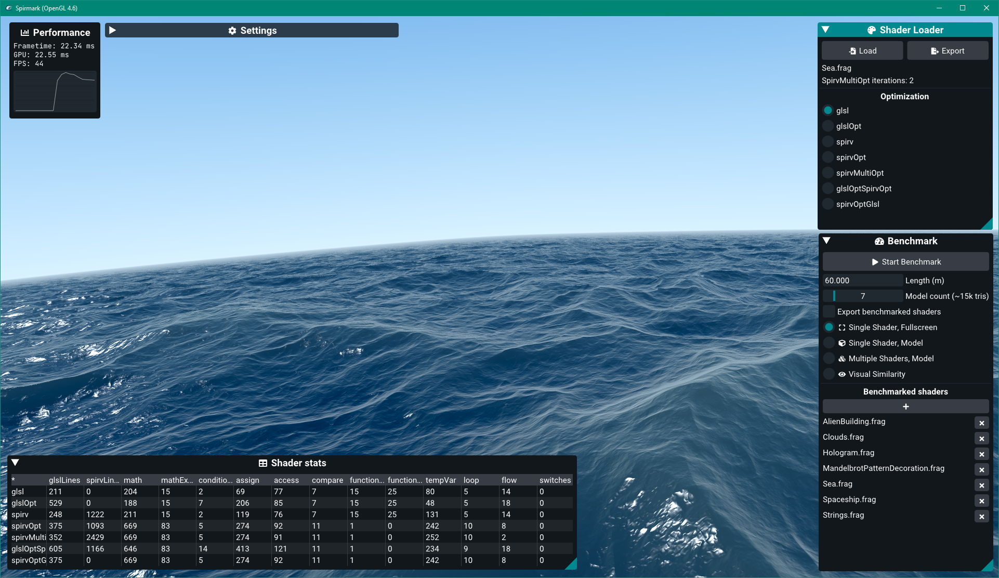

# Spirmark

Spirmark is a complex tool for evaluating the performance and viability of optimizing OpenGL GLSL shaders with [GLSL Optimizer](https://github.com/aras-p/glsl-optimizer) and [Glslang](https://github.com/KhronosGroup/glslang) / [SPIRV-Tools](https://github.com/KhronosGroup/SPIRV-Tools).

## Building Spirmark

Clone the git repository with the `--recursive` flag.

``git clone https://github.com/codingoat/Spirmark --recursive``

Download and unzip [the project dependencies](https://drive.google.com/drive/folders/1tZlbqnhhNhjtjBjjFs8RedEAtOfTnN0L?usp=sharing) in the `dependencies` folder.

Create a build folder, and run CMake. On Linux, use the optional `-DCMAKE_BUILD_TYPE=Release` or `Debug` flags of CMake.

``mkdir cmake-build
cd cmake-build
cmake ..``

On Windows, open the generated Visual Studio project. On Linux, run `make` to compile the program.

The program is compiled to `[cmakefolder]/_output/Debug` or `[cmakefolder]/_output/Release`. To distribute the application, copy `Spirmark.exe` to `/_output/`, delete the `Debug` and `Release` folders, and zip the `_output` folder.